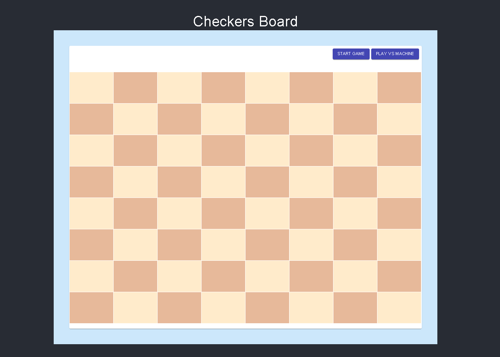
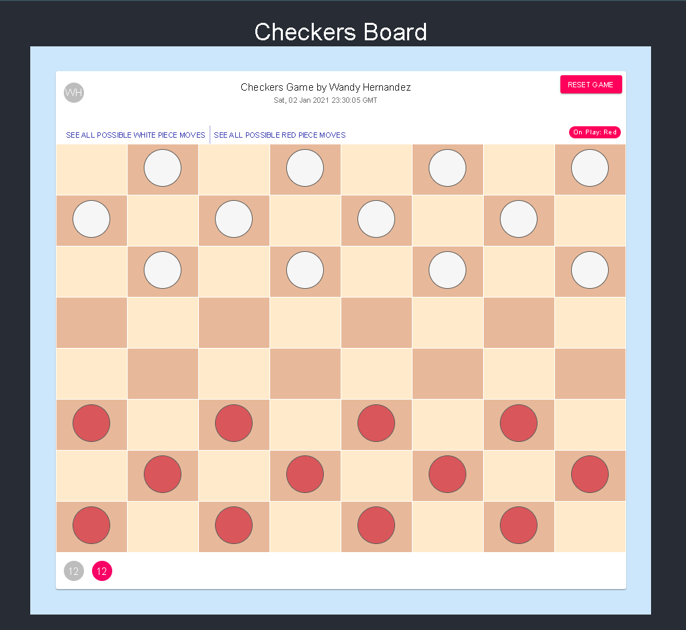
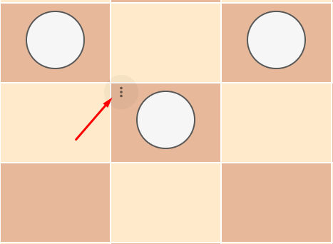
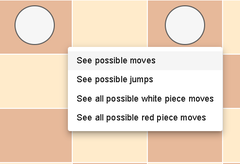
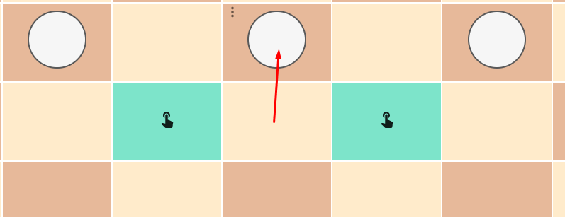
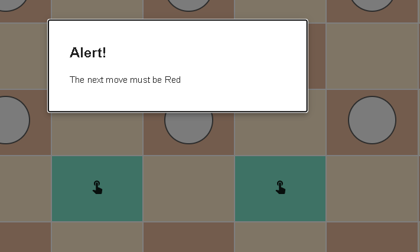
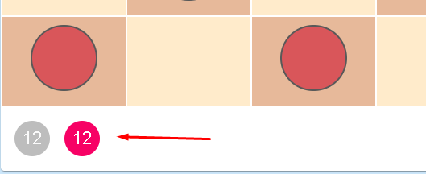

# CHECKERS GAME DOCUMENTATION #

This README would normally document whatever steps are necessary to get your application up and running.

### What is this repository for? ###

* Quick summary

    This application simulates the game of checkers. Its purpose is for practical use and as an exercise for interested parties.
* Version
    v0.0.0-beta
* [Learn Markdown](https://bitbucket.org/tutorials/markdowndemo)

### How do I get set up? ###

* Summary of set up
    - Docker: is a set of platform as a service products that use OS-level virtualization to deliver software in packages called containers.
    - node: JavaScript runtime environment that executes JavaScript code outside a web browser.
* Dependencies
    - react v17.0.1
    - material-ui v4.11.2
    - lodash v4.17.20
    - classnames v2.2.6
* Requirements
   * node 10.14.2 or higher
   * yarn (not necessary)
   * Docker v18.09.0 or higher (For installation through Docker)
   * docker-compose v3.2 or higher (For installation through Docker)
* Deployment instructions     
    1. __Via node__ 
        
        a. Go to app directory:
        ```shell script
         $ cd app
        ```
        b. Install dependencies 
        ```shell script
           $ npm install or yarn install
        ``` 
        c. Start application
        ```shell script
           $ npm start or yarn start
         ``` 
       > The application will start in port 3000, go to your browser and type http://localhost:3000
    
    2. __Via Docker__
        > If you are a docker user and you want to run the application in an external environment without installing dependencies in your work environment, then this section will look great for you, let's go there.
    
        a. Run the following command
        ```shell script
           $ docker-compose up -d --build
        ```         
        > Go to your browser and type http://localhost:3000                                                                                                                                                                                                                                                                                                                                                                                                                                                                                               

If everything went well you can go to the next step.

### Important commands ###
1. npm start | yarn start: Start the application.
2. npm build | yarn build: Build the application for production.
3. npm run formatCode | yarn formatCode: Format the code using the prettier library, see the prettierrc.json file for the formats.

### Application Overview ###
1. Welcome Screen: from this screen you can start the game by clicking the Start Game button and you can also start a game against the machine by clicking the Play vs Machine button.


2. Play Game Screen: It is the screen to start the game, by default the red pieces make the first move.


2. Application Header: Contains options to control the game.

    1. (1) This button restarts the game by redirecting the application to the welcome screen.
    2. (2) Show which piece is in play.
    3. (3) Prints out the position of all the pieces that are valid moves for white color.
    4. (4) Prints out the position of all the pieces that are valid moves for red color.

3. Menu Icon: Displays the menu with options that apply to the selected piece. To enable it you must put the mouse over the part box.



4. Menu Options: Displays the menu with options that apply to the selected piece.

__See Possible Moves:__ takes a piece on the board, and prints out all the possible moves.
__See Possible Jumps:__ takes a piece on the board, and prints out all the possible jumps.
__See all possible white piece moves:__ Same as the option in the header, prints out the position of all the pieces that are valid moves for white color.
__See all possible red piece moves:__ Same as the option in the header, prints out the position of all the pieces that are valid moves for red color.



5. Jump Options: Click on the piece to see the possible positions where you can play. To move to the position you must click on the hand icon.



6. Notification: Displays an alert when a game rule breaks or when the game ends.



6. Piece counting: Keeps the count of the remaining pieces of each player or color.



### Code Overview ###

* Structure: The main objective is to separate the structure by modules, where each module must be able to execute all its actions independently of any other, and if any communication is required towards another external component, it must be provided through the hooks, actions or selectors.

```shell script
root-directory
├── Dockerfile
├── docker-compose.yml
├── documentation
|   └── README.md
└── app
    ├── build
    ├── public  
    |   └── ...
    ├── .env.dist
    ├── .gitignore
    ├── .prettierignore
    ├── .prettierrc.json 
    ├── .editorconfig  
    ├── package.json
    └── src
        ├── index.js  
        ├── setupTests.js
        ├── core
        |   ├── index.js
        |   ├── boardData.js
        |   ├── constants.js
        |   ├── utils.js
        |   ├── components
        |   ├── contextAPI
        |   └── hooks
        └── modules 
            └── checkers
                ├── index.js
                ├── components
                └── hooks
                
```

* Code review
> App.js is the root component which imports the main CheckersBoard component which contains the game logic and is the one that reuses all the other components.

Inside the core module is the utils.js file with the main functions reused by the application, among which are the following recursive functions:
1. findAllPositionsByDiagonalDirection (line 51)
2. findAllPossibleJumpPositions (line 101)
3. findAllPossibleMovesByKing (line 202)
4. getPieceMovingLeftDirection (line 252)
5. getPieceMovingRightDirection (line 302)

In the Core module there is also the boardData.js file, this contains all the data to populate the board with the correct positions.
```js
[
    {
        "index": 0, /* Identifies the position on the board */    
        "isKing": false, /* Identifies piece type */   
        "color": constants.MAIN_PIECE_COLOR,  /* Color of the piece on the board */
        "isLocked": true, /* Lock the position of the board so that the piece cannot move there. */
        "isAvailable": true, /* When this is true it does not allow the pieces to move there, if it is false then it means that there is a piece in that position and that it can be skipped. */
        "showMenu": false, /* Show the menu for a specific piece */
    },
    ...
]
```

The constants.js file contains all the constants used by the application, including the most important ones MAIN_PIECE_COLOR, with the value White, and the constant SECONDARY_PIECE_COLOR with the value Red. The color of the pieces and other settings depend on these constants.

### Bugs ###
1. The machine sometimes does not jump the pieces of the enemy
2. Sometimes the jumps of the pieces do not show them in adjacent mode.

### Estimated development time ###
- December 30: 3 hours (Analysis and design)
- December 31: 3.5 hours (Development)
- January 01: 3 hours (Development and Testing)
- January 02: 3 hours (Testing, Documentation and Deployment Configuration)
- Estimated hours worked: 12 hours
